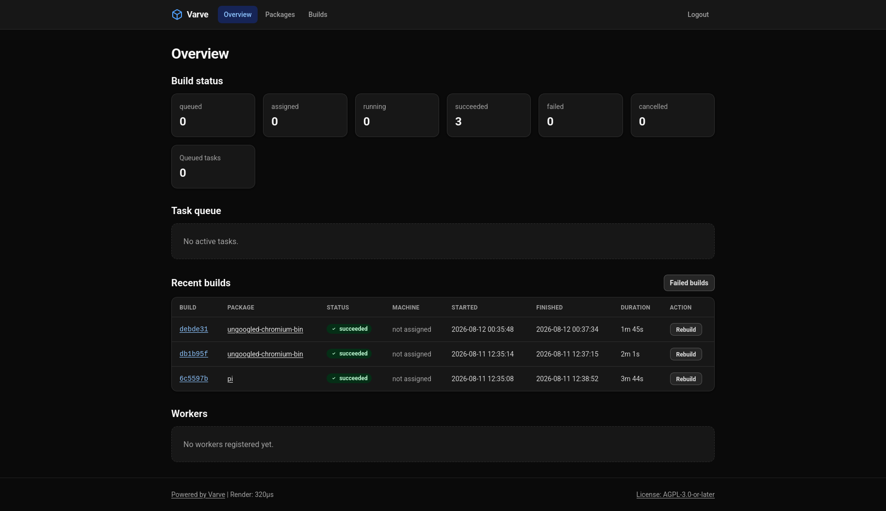

# Varve

Varve is a self-hosted, Git-driven automatic build and distribution system for
Arch Linux packages. It watches a source repository (one branch per package),
detects changes in branch commits, upstream VCS references and external
PKGBUILD sources, schedules builds on isolated workers, and publishes the
artifacts into a flat pacman repository backed by a local directory or any
S3-compatible object store (MinIO, SeaweedFS, Ceph RGW, Cloudflare R2, ...).



## Overview

Varve replaces the manual "edit PKGBUILD, run makepkg, repo-add, upload"
loop with a controller that owns the whole pipeline:

1. **Detect** - poll a Git source repository, diff each package branch against
   its last known state, and enqueue a build when something changed (branch
   commit, upstream `-git`/`-svn` reference, or an external PKGBUILD repo).
2. **Dispatch** - a scheduler assigns queued tasks to workers in FIFO order
   (per architecture), tracks heartbeats, and recovers stalled or timed-out
   tasks.
3. **Build** - workers run `makepkg` inside isolated containers, stream build
   logs back to the controller, and upload the signed artifacts.
4. **Ingest** - the controller verifies artifacts (existence, SHA-256,
   GPG signature), runs `repo-add`/`repo-remove` to maintain the repository
   database, writes the authoritative per-package sidecar, and optionally
   publishes the PKGBUILD to the AUR.
5. **Notify** - failed builds and AUR push failures are reported by email to
   the package maintainers.

### Feature highlights

- **Three worker shapes**: host mode (the worker process starts build
  containers itself), a resident agent pool, and one-shot agents driven by
  GitHub Actions workflow runs.
- **Flat pacman repository**: `<name>.db` / `<name>.files` in the canonical
  dual form (real archive plus the `.db`/`.files` names pacman fetches), GPG
  signing of packages and/or the database, version pruning
  (`keep_versions = 1`).
- **Local or S3 storage**: the two backends are symmetric - same object
  layout, same prefix rules, same streaming uploads, paginated listing,
  content-type inference, MIME-correct uploads.
- **Web UI**: server-rendered dashboard, build details with live SSE log
  streaming (resumable), full log downloads, package search and browsing,
  admin actions (cancel, rebuild, disable/remove workers). No JavaScript
  required, WCAG 2.2 AA.
- **Resilience**: retry budget for agent-reported build failures, cooldown
  re-enqueue for failed packages, automatic requeue on first stall, graceful
  shutdown with a second-signal force exit, `flock` mutual exclusion between
  `serve` and `rebuild-index`, embedded SQLite migrations (001-011).
- **Security**: bearer-token auth (constant-time), per-task claim tokens,
  GPG passphrases never on argv, VCS URL scheme whitelist, strict path and
  name validation, mandatory `Content-Length` with size limits, SSE
  concurrency caps, same-origin CSRF protection for admin actions.

## Architecture

Varve ships as two binaries (two container images, both based on Arch Linux):

```
                        source repository (one branch per package)
                                    |
                                    v
        +-----------------------------------------------------------+
        |                        controller                         |
        |  cmd/varve                                                |
        |                                                           |
        |  detect (mirror + diff + VCS upstream check)              |
        |      |                                                    |
        |      v                                                    |
        |  dispatch scheduler  ->  SQLite queue (tasks + builds)    |
        |      |                                                    |
        |      +-- worker API (:31759) <----+   web UI (:31760)     |
        |      |                            |                       |
        |      |   repo ingest (repo-add)   |   SSE log streams     |
        |      v                            |                       |
        |  storage (local dir or S3)        |                       |
        +-----------------------------------------------------------+
              ^                            |
              | poll / heartbeat /         |
              | log / upload / result      |
        +-----+----------------------------+---------------------+
        |                     worker (cmd/varve-worker)           |
        |                                                         |
        |  host mode: starts one build container per task         |
        |  agent pool: resident containers executing tasks        |
        |  one-shot: GitHub Actions workflow run per task         |
        +---------------------------------------------------------+
```

### Controller

A single assembly point that owns the SQLite database (WAL), the storage
backend, the GPG keyring, the source mirror, the scheduler and the build
logs. It exposes the worker API on `server.api_listen` and the web UI on
`server.web_listen`. The controller must run where `repo-add` is available
and where the storage backend is reachable.

### Workers

`cmd/varve-worker` is configured entirely by environment variables and has
three modes:

| Mode | How it builds | When to use |
|---|---|---|
| `host` (default) | The worker process launches a fresh container per task (`docker` or `podman`) and supervises it | One machine that can run containers |
| `agent` pool | A resident agent process polls for tasks and builds them inside its own container | Pre-provisioned build hosts |
| `agent` one-shot | A GitHub Actions workflow run (see `examples/worker-actions.yml`) polls for exactly one task, builds it, and exits | Elastic runners; the controller triggers one workflow run per queued task via the `workflow_dispatch` API |

### Key design points

- **Retry semantics**: the retry budget (`worker.retry_max`, default 3) is
  reserved for *agent-reported build failures*. Controller-side failures
  (stall, timeout, verification, ingest) are terminal by design - recovery
  happens through the per-package cooldown
  (`worker.failed_rebuild_cooldown`) after which detection re-enqueues the
  package. A first stall is requeued once implicitly.
- **Terminal states are final**: once a task is `succeeded`/`failed`/
  `cancelled`, late reports, log appends and uploads get `409 Conflict`.
- **The ingest chain outlives the HTTP request**: artifact verification and
  repository ingest run on a context detached from request cancellation
  (15 min budget), so a worker that times out mid-report cannot abort a
  large ingest. Terminal database writes use a settled 30 s context so the
  final state always lands in SQLite even if the client is gone.
- **Ordered ingest**: repository database update happens before the
  per-package sidecar rewrite, and the SQLite finalization transaction after
  both - a crash at any point converges on retry instead of corrupting the
  repo.
- **Dual database form**: locally, `<name>.db` is a symlink to
  `<name>.db.tar.gz`; on S3 both forms are uploaded as separate objects with
  identical bytes. Same for `.files`.
- **Log retention**: `logs.retention`, `logs.max_builds` and
  `logs.keep_successful` only prune *successful* build logs; failed and
  cancelled builds keep their logs forever.

## Installation

### From source

Prerequisites:

- Go 1.26 or newer
- `tailwindcss` CLI (v4) on `PATH` to regenerate the embedded stylesheet

```sh
go generate ./...          # renders internal/web/static/app.css (embedded)
go build ./cmd/varve
go build ./cmd/varve-worker
```

The resulting binaries are self-contained (pure-Go SQLite, no CGO). Verify
with `./varve --version` and `./varve --help`.

### Container images

Two images are built from `Containerfile.controller` and
`Containerfile.worker` (Arch-based, built with kaniko in CI). The controller
image carries `git`, `subversion`, `openssh`, `gnupg` and `repo-add`; the
worker image is `archlinux/archlinux:multilib-devel` with a `builder` user
that has passwordless sudo for `makepkg -s` dependency installation.

> **Important**: the controller and worker speak a versioned wire protocol.
> Always deploy both images together - a worker from an older release
> against a newer controller will be rejected.

## Quickstart

### 1. Prepare a source repository

Create a Git repository where **each branch is one package** (the branch
name is the package base name). On each branch, commit a PKGBUILD and an
optional `.varve.toml` dotfile modeled on `examples/varve-branch.toml`
(maintainers, external PKGBUILD source, `collect.exclude` globs, AUR
submission settings, pre/post build hooks).

Push the branch. Varve will pick it up on the next poll.

### 2. Configure the controller

Copy `examples/varve.toml` to `/data/varve.toml` and edit it - the file is
fully commented and covers every section (`[server]`, `[api]`, `[database]`,
`[storage]`, `[repo]`, `[gpg]`, `[source]`, `[worker]`, `[mail]`, `[aur]`,
`[web]`, `[[web.admins]]`, `[logs]`). At minimum, set `api.token`,
`source.url`, a storage backend and one admin account.

Secrets (`api.token`, mail password, gpg passphrase, admin passwords,
`worker.actions.token`) can only be set in the TOML or via their dedicated
environment variables (`VARVE_API_TOKEN`, `VARVE_S3_ACCESS_KEY`,
`VARVE_S3_SECRET_KEY`, `VARVE_SOURCE_FETCH_KEY`) - never from the
environment generically.

### 3. Run the controller

```sh
varve serve --config /data/varve.toml
# or, equivalently:
varve --config /data/varve.toml
```

On startup the controller acquires a `flock` on `<database>.lock` (a second
`serve` or `rebuild-index` process exits with an error), opens the database
(running embedded migrations automatically), starts the scheduler and the
detector, and serves both HTTP endpoints. `SIGTERM`/`SIGINT` triggers a
graceful shutdown (scheduler stop, ingest drain, HTTP drain) within a 30 s
budget; a second signal forces immediate exit.

### 4. Run a worker

Host mode (one machine with docker/podman):

```sh
export VARVE_CONTROLLER_URL=http://controller.example.org:31759
export VARVE_TOKEN=change-me-to-a-long-random-secret
export VARVE_WORKER_IMAGE=archlinux/archlinux:multilib-devel
export VARVE_WORKER_CONCURRENCY=2
varve-worker
```

GitHub Actions one-shot mode (elastic): enable `[worker.actions]` on the
controller (token, repo, workflow, `max_concurrency`, `claim_timeout`) and
mirror `examples/worker-actions.yml` into your runner repository. The
controller triggers one workflow run per queued task; each run builds
exactly one task and exits. The shared controller token is never injected
into build containers - each task uses a per-task claim token instead.

### 5. Watch it build

- Web UI: `https://varve.example.org` - dashboard, live log streaming
  (`/builds/<id>/log/stream`), full log download, package pages.
- The flat repository appears in the storage root: `<name>.db`,
  `<name>.files`, `<pkgbase>-<version>-<arch>.pkg.tar.zst` (+ `.sig`),
  where `<name>` is `repo.name` from the controller configuration.
- Point pacman at the repository, e.g. with `Server =
  https://dl.example.org/pkgs` in `pacman.conf`.

### 6. Maintenance

- `varve rebuild-index --config /data/varve.toml` - rebuild the SQLite index
  from the stored sidecars (`*.meta.toml`). Safe to run while `serve` is
  stopped; mutually exclusive with a running controller via the lock file.
- Failed packages re-enter the queue automatically after
  `worker.failed_rebuild_cooldown` (default 1 h).
- Backups: the SQLite database (hot-backup friendly WAL), the storage
  backend (local directory or bucket), `/data/gnupg`, and the log directory.
  The source mirror under `/data/source` is regenerable.

## Deployment notes

- **Ports**: worker API `:31759` (controller-facing), web UI `:31760`.
  Terminate TLS in front (Caddy/nginx); Varve serves plain HTTP and there is
  no built-in health endpoint - polling `/` on the web port is a sufficient
  readiness check.
- **Data layout**: the controller expects its state under one volume
  (`/data`): config, database, logs, repo, source mirror, GNUPGHOME, and
  `work_dir` for `repo-add` when the S3 backend is used (repo database
  updates run on the controller host, so `pacman`/`repo-add` must be present
  there).
- **S3 backend**: `storage.s3.repo_prefix` (default: bucket root) and
  `staging_prefix` (default `staging`) must not nest; staging objects are
  excluded from repository listings. Leftover staging objects are pruned by
  your bucket lifecycle rules (automatic staging sweep exists for the local
  backend only).
- **Upgrades**: deploy the controller and worker images together (same
  version), then `rebuild-index` is not required - migrations run
  automatically on startup.

## License

Copyright (C) 2026 ShinKouyo \<i@0x0f.dev\>

This program is free software: you can redistribute it and/or modify it under the terms of the GNU Affero General Public License as published by the Free Software Foundation, either version 3 of the License, or (at your option) any later version.

This program is distributed in the hope that it will be useful, but WITHOUT ANY WARRANTY; without even the implied warranty of MERCHANTABILITY or FITNESS FOR A PARTICULAR PURPOSE. See the GNU Affero General Public License for more details.

The full license text is available at [COPYING](/COPYING).
